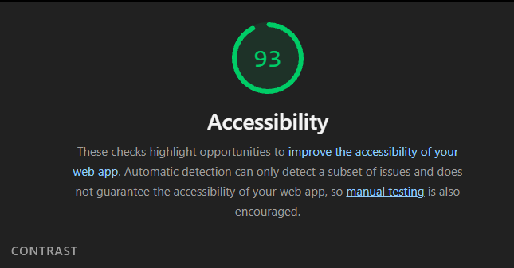

# Web LAB-1
## Hakkinda
Bu proje, Web Tasarimi ve Programlama dersi LAB-1 kapsaminda Vite + React + TypeScript kullanilarak olusturulmustur.

## Gelistirici
**Ad Soyad:** Osman Kerim Ögütçü
**Öğrenci No:** 230541048

## Erişilebilirlik Testi (Lighthouse)

[cite_start]Bu proje, herkes tarafından kullanılabilir olması için erişilebilirlik (a11y) standartlarına uygun olarak geliştirilmiştir[cite: 161, 162]. [cite_start]Yapılan analiz sonucunda Lighthouse erişilebilirlik puanı 90 ve üzerine çıkarılmıştır[cite: 25, 607].



## Kullanilan Teknolojiler
* React 18
* TypeScript
* Vite

## Kurulum
```bash
npm install